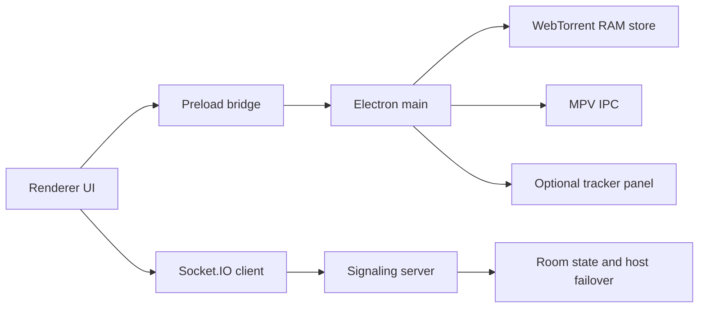

# Torrgether

Torrgether is a desktop app for watching legal torrent video together. The app
keeps media chunks in RAM, launches MPV as the only playback engine, and uses a
small signaling server to sync rooms, torrent selection, host failover, and
playback commands.

## What Is New In 0.3

- Catalog-style desktop UI with search, posters, source results, torrent detail
  rows, room controls, MPV controls, RAM cache status, participants, and logs.
- Source provider layer with duplicate collapsing by info hash, magnet `btih`,
  or normalized title/size/quality metadata.
- Open-license catalog support through local curated entries and Archive.org
  search. RuTracker remains an optional isolated browser panel.
- In-app GitHub release update checks for `ShewasD/torrgether`.
- Larger locale set for the interface plus a separate content/audio language
  filter with fallback warnings when no matching audio language is found.
- Bounded log rotation, stricter auth/token/CORS checks, safer torrent download
  validation, and RAM-only `.torrent` import from the embedded tracker panel.

## Install

### Windows From Source

```powershell
.\install.cmd -Run -InstallMpv
```

Useful options:

```powershell
.\install.cmd -Help
.\install.cmd -InstallMpv
.\install.cmd -AddToUserPath
.\install.cmd -AddToSystemPath
.\install.cmd -InstallMpv -AddToSystemPath -Run
.\install.cmd -BuildWin
```

`-AddToSystemPath` requires Administrator. The installer pins portable Node to
`v24.15.0` unless `TORRGETHER_NODE_VERSION` is set.

### Linux From Source

```bash
chmod +x install.sh start-client.sh start-server.sh
./install.sh --install-mpv --system-path --run
```

Build packages:

```bash
./install.sh --build-linux
```

Cross-building the Windows installer from Linux requires Wine. Without Wine,
`./install.sh --build-win` exits with a clear error.

## Packaged Builds

GitHub tag pushes matching `v*` run `.github/workflows/release.yml`. The release
workflow builds and uploads:

- `Torrgether-Setup-<version>.exe`
- `Torrgether-<version>.AppImage`
- `Torrgether-<version>.deb`

The app checks the latest GitHub release and opens the release page when an
update is available.

## Configuration

Copy `.env.example` and set only the values you need.

Common client variables:

```bash
SERVER_URL=http://localhost:3000
SERVER_TOKEN=long-random-token
MPV_PATH=/custom/path/to/mpv
MAX_MEMORY_MB=512
MAX_MEMORY_CHUNKS=384
CONTENT_AUDIO_LANGUAGE=any
UPDATE_REPO=ShewasD/torrgether
UPDATE_CHECK_INTERVAL_MS=21600000
LOG_LEVEL=info
LOG_MAX_BYTES=5242880
LOG_MAX_FILES=5
```

Common server variables:

```bash
HOST=0.0.0.0
PORT=3000
PUBLIC_URL=https://watch.example.com
CORS_ORIGIN=https://watch.example.com
SERVER_TOKEN=long-random-token
ROOM_EMPTY_TTL_MS=300000
```

For production, set `SERVER_TOKEN` and restrict `CORS_ORIGIN`. `CORS_ORIGIN=*`
is only appropriate for local development.

## Architecture



The local WebTorrent HTTP server binds to `127.0.0.1`; MPV reads from that local
URL. Torrent media chunks are stored in `desktop/LruMemoryChunkStore.js`, not in
a disk cache.

## Security Model

- MPV is the only player. Browser `<video>` playback is intentionally absent.
- `.torrent` payloads imported from embedded tracker downloads are fetched into
  memory and sent to the renderer as base64; no temporary `.torrent` file is
  written for that flow.
- The RuTracker surface is an Electron `WebContentsView` with
  `nodeIntegration: false`, `contextIsolation: true`, `sandbox: true`, and
  navigation limited to RuTracker top-level URLs. External links open in the
  system browser.
- Server token checks compare SHA-256 digests with `timingSafeEqual`.
- Auth rate limiting has expiry cleanup and a maximum key count.
- Logs redact tokens, passwords, magnet URIs, base64 payloads, and local paths.

## RAM-Only Policy

RAM-only means torrent media chunks and embedded `.torrent` imports are not
cached to disk. Build outputs, release installers, package-manager caches, OS
logs, and bounded application logs are normal files.

Relevant controls:

```bash
MAX_MEMORY_MB=512
MAX_MEMORY_CHUNKS=384
RAM_STORE_LOW_WATERMARK_RATIO=0.85
MAX_PENDING_RAM_READS=256
MPV_CACHE_SECS=60
MPV_DEMUXER_MAX_BYTES=
```

When RAM pressure is high, the store evicts old chunks, marks evicted pieces
unverified, and lets WebTorrent refetch them instead of ending MPV's stream
early.

## Development

If global Node/npm is unavailable, use the portable toolchain:

```powershell
$env:PATH = "$PWD\.tools\node;$env:PATH"
.\.tools\node\npm.cmd run check
.\.tools\node\npm.cmd test
```

In locked-down Windows environments where `.tools\node\node.exe` returns
`Access is denied`, use another Node 20+ install or the Codex bundled runtime.

Standard checks:

```bash
npm run check
npm run lint
npm test
npm run pack
```

## Troubleshooting

- MPV missing: run `.\install.cmd -InstallMpv` on Windows or
  `./install.sh --install-mpv` on Linux.
- Installer launches an old app: uninstall old builds first, then install the
  latest `Torrgether-Setup-<version>.exe` from GitHub Releases.
- No public server access: set `PUBLIC_URL`, `CORS_ORIGIN`, and `SERVER_TOKEN`
  on the signaling server.
- Playback stalls: lower `MPV_CACHE_SECS`, lower video quality, or increase
  `MAX_MEMORY_MB` if the machine has enough RAM.

## Legal Use

Use only content that you are allowed to distribute and watch: your own videos,
public-domain films, open-license media, Linux ISOs, private torrents, or other
content where you have the required rights.
