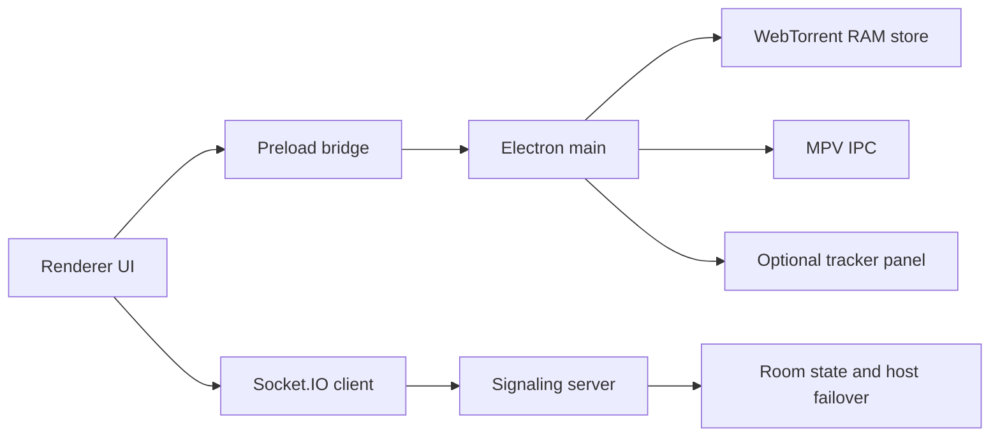

# Torrgether

Torrgether is a desktop app for watching legal torrent video together. The app
keeps media chunks in RAM, launches MPV as the primary playback engine, uses a
built-in player fallback for browser-supported video formats, and uses a small
signaling server to sync rooms, torrent selection, host failover, and playback
commands.

Current release line: `0.4.4`. See `docs/CHANGELOG.md` for release notes.

## What Is New In 0.4.4

- Watch is now focused on playback, torrent import, selected file, room state,
  connection state, and playback/buffering/error state.
- Settings now contains logs, diagnostics, server settings, MPV status,
  WebTorrent/RAM diagnostics, RuTracker advanced import, and developer controls.
- Renderer DOM handling is safer around optional elements and stale tab
  references from the older UI have been removed.
- Documentation now covers install/build/test flow, self-hosted signaling,
  production CORS, SERVER_TOKEN generation, privacy, MPV, RuTracker sessions,
  Windows release notes, and known limitations.

## What Is New In 0.4

- RAM-only playback is stricter: MPV defaults to a 10 second RAM buffer,
  `24MiB` demuxer memory, no disk cache, smaller WebTorrent connection counts,
  and capped local HTTP range reads.
- `LruMemoryChunkStore` now tracks MPV range reads, protects active playback
  windows, evicts old chunks under heap pressure, and prioritizes refetches for
  pieces MPV seeks back to.
- MPV shutdown is more reliable: Torrgether asks MPV to quit over IPC, then
  falls back to process-tree termination if the player hangs.
- Signaling is hardened with explicit Socket.IO ping/pong timing, bounded room
  creation, disabled connection-state recovery by default, and safer auth
  limiter behavior.
- Update checks, source-provider requests, poster URLs, catalog search races,
  renderer log updates, and RuTracker imports have stricter timeouts and
  validation.

## Install

### Windows From Source

```powershell
.\install.cmd -Run -InstallMpv
```

Useful options:

```powershell
.\install.cmd -Help
.\install.cmd -InstallMpv
.\install.cmd -AddToUserPath
.\install.cmd -AddToSystemPath
.\install.cmd -InstallMpv -AddToSystemPath -Run
.\install.cmd -BuildWin
```

`-AddToSystemPath` requires Administrator. The installer pins portable Node to
`v24.15.0` unless `TORRGETHER_NODE_VERSION` is set.

### Linux From Source

```bash
chmod +x install.sh start-client.sh start-server.sh
./install.sh --install-mpv --system-path --run
```

Build packages:

```bash
./install.sh --build-linux
```

Cross-building the Windows installer from Linux requires Wine. Without Wine,
`./install.sh --build-win` exits with a clear error.

## Supported OS

- Windows x64 is the primary packaged target.
- Linux x64 builds are produced as AppImage and deb packages.
- macOS scripts are present, but macOS packages are not part of the current
  release workflow and need manual validation before publishing.

## MPV And Playback

MPV is required for reliable playback, MKV files, subtitles, and room-synced
external playback. Torrgether can fall back to the built-in Chromium video
player only when the selected file format is supported by the browser runtime
(`.mp4`, `.m4v`, `.webm`, `.ogv`, `.ogg`, `.mov`). Treat the built-in player as
a recovery path, not as the main supported player.

## Packaged Builds

GitHub tag pushes matching `v*` run `.github/workflows/release.yml`. The release
workflow builds and uploads:

- `Torrgether-Setup-<version>.exe`
- `Torrgether-<version>.AppImage`
- `Torrgether-<version>.deb`

The app checks the latest GitHub release and opens the release page when an
update is available.

Windows installers are not code-signed in this project by default. Microsoft
SmartScreen may warn on fresh or unsigned builds until a signed release process
is added.

## Configuration

Copy `.env.example` and set only the values you need.

Common client variables:

```bash
SERVER_URL=http://localhost:3000
SERVER_TOKEN=long-random-token
MPV_PATH=/custom/path/to/mpv
MAX_MEMORY_MB=512
MAX_MEMORY_CHUNKS=384
MAX_PENDING_RAM_READS=64
MPV_CACHE_SECS=10
MPV_DEMUXER_MAX_BYTES=24MiB
MPV_LOW_CACHE_EVENT_INTERVAL_MS=15000
MPV_STDIO_LOG_INTERVAL_MS=1000
WEBTORRENT_MAX_CONNS=30
WEBTORRENT_MAX_WEB_CONNS=4
CONTENT_AUDIO_LANGUAGE=any
UPDATE_REPO=ShewasD/torrgether
UPDATE_CHECK_INTERVAL_MS=21600000
LOG_LEVEL=info
# 5 MiB
LOG_MAX_BYTES=5242880
LOG_MAX_FILES=5
```

Common server variables:

```bash
HOST=0.0.0.0
PORT=3000
PUBLIC_URL=https://watch.example.com
CORS_ORIGIN=https://watch.example.com
SERVER_TOKEN=long-random-token
ROOM_EMPTY_TTL_MS=300000
MAX_ROOMS=5000
MAX_USERS_PER_ROOM=32
CONTROL_RATE_LIMIT_WINDOW_MS=10000
CONTROL_RATE_LIMIT_MAX=30
TORRENT_PAYLOAD_CACHE_TTL_MS=600000
TORRENT_PAYLOAD_CACHE_MAX_BYTES=33554432
TORRENT_PAYLOAD_CACHE_MAX_ENTRIES=128
SOCKET_PING_INTERVAL_MS=30000
SOCKET_PING_TIMEOUT_MS=60000
SOCKET_CONNECTION_STATE_RECOVERY=0
TRUST_PROXY=0
```

For production, set `SERVER_TOKEN` and restrict `CORS_ORIGIN`. `CORS_ORIGIN=*`
is only appropriate for local development.

Generate production tokens with a cryptographically random value, for example:

```bash
node -e "console.log(require('crypto').randomBytes(32).toString('hex'))"
```

Only set `TRUST_PROXY=1` when the server is behind a reverse proxy that strips
untrusted forwarding headers and sets `x-forwarded-for` itself.

## Self-Hosting Signaling

Run `npm run server` on the host that participants can reach, set
`PUBLIC_URL`, `CORS_ORIGIN`, and the same `SERVER_TOKEN` on clients and server.
Use HTTPS for public rooms. The server limits room count, users per room,
playback command rate, Socket.IO payload size, and temporary `.torrent` payload
cache size. `.torrent` payloads are not included in every room snapshot; clients
fetch them on demand by payload reference.

Minimum practical client requirements depend on video bitrate. Start with 8 GB
RAM for HD content, working MPV, and enough network throughput for the selected
torrent. For lower-RAM machines, reduce `MAX_MEMORY_MB`, `MPV_CACHE_SECS`, and
the selected video quality.

## Build Notes

- `npm install` installs runtime and build dependencies, including the explicit
  `7zip-bin` dev dependency used by the Windows MPV bundling step.
- `npm run build` is an alias for `npm run pack` and creates an unpacked
  Electron build under `dist/`.
- Use `npm run dist:win`, `npm run dist:linux`, or `npm run dist:mac` for
  package artifacts.
- Linux packaging may require system libraries used by Electron builder and deb
  packaging tools. The generated deb declares runtime dependencies including
  GTK, NSS, X11 helper libraries, libsecret, and `mpv`.
- `install.sh` downloads portable Node over HTTPS and verifies the archive
  against Node's SHA256 manifest. MPV packages are installed through the system
  package manager on Linux; Windows MPV bundling uses `build/install-mpv.ps1`
  and `7zip-bin`. Review downloaded binaries as part of your release
  supply-chain process.

## Architecture



The local WebTorrent HTTP server binds to `127.0.0.1`; MPV reads from that local
URL. Torrent media chunks are stored in `desktop/LruMemoryChunkStore.js`, not in
a disk cache.

## Security Model

- MPV is the primary player. Browser `<video>` playback is limited to a
  built-in fallback for formats Chromium can play directly.
- `.torrent` payloads imported from embedded tracker downloads are fetched into
  memory and sent to the renderer as base64; no temporary `.torrent` file is
  written for that flow.
- Signaling snapshots carry `.torrent` payload references, not base64 payloads;
  room members request the payload separately through an authenticated Socket.IO
  ACK flow. Payload references expire from a bounded in-memory cache.
- The RuTracker surface is an Electron `WebContentsView` with
  `nodeIntegration: false`, `contextIsolation: true`, `sandbox: true`, and
  navigation limited to exact RuTracker top-level HTTPS URLs. External HTTP(S)
  links open in the system browser.
- Server token checks compare SHA-256 digests with `timingSafeEqual`.
- Auth rate limiting has expiry cleanup and a maximum key count.
- Logs redact tokens, passwords, magnet URIs, base64 payloads, and local paths.
- Catalog torrent imports allow HTTPS URLs only and block localhost/private
  address targets before fetching from the Electron main process.

## Privacy Notes

RAM-only storage does not make BitTorrent anonymous. Unless WebTorrent itself is
configured differently in a future release, peers in the torrent swarm may see
your IP address. RuTracker uses a persistent Electron partition so login cookies
can survive app restarts; torrent data still stays out of the disk cache managed
by Torrgether.

The signaling server sees room IDs, display names, socket IDs, playback state,
and torrent metadata needed for synchronization. Use a private `SERVER_TOKEN`
and HTTPS for public deployments.

## RAM-Only Policy

RAM-only means torrent media chunks and embedded `.torrent` imports are not
cached to disk. Build outputs, release installers, package-manager caches, OS
logs, and bounded application logs are normal files.

Relevant controls:

```bash
MAX_MEMORY_MB=512
MAX_MEMORY_CHUNKS=384
MAX_PENDING_RAM_READS=64
RAM_STORE_LOW_WATERMARK_RATIO=0.75
RAM_STORE_RECENT_EVICTION_TTL_MS=30000
RAM_STORE_WINDOW_AHEAD_SECS=30
RAM_STORE_WINDOW_BEHIND_SECS=10
MPV_CACHE_SECS=10
MPV_DEMUXER_MAX_BYTES=24MiB
MPV_DEMUXER_MAX_BACK_BYTES=8MiB
MPV_LOW_CACHE_THRESHOLD_SECONDS=0.5
MPV_LOW_CACHE_EVENT_INTERVAL_MS=15000
MPV_STDIO_LOG_INTERVAL_MS=1000
MPV_STDIO_LOG_MAX_BYTES=2000
WEBTORRENT_MAX_CONNS=30
WEBTORRENT_MAX_WEB_CONNS=4
STREAM_RANGE_MAX_BYTES=50MiB
TORRENT_PAYLOAD_CACHE_TTL_MS=600000
TORRENT_PAYLOAD_CACHE_MAX_BYTES=33554432
```

When RAM pressure is high, the store evicts old chunks and uses WebTorrent's
public rescan/refetch path for stale reads instead of ending MPV's stream early.
`MAX_MEMORY_BYTES`, when set, still overrides the calculated RAM store budget;
otherwise Torrgether reserves memory for MPV and Electron before sizing the
chunk store.

## Development

If global Node/npm is unavailable, use the portable toolchain:

```powershell
$env:PATH = "$PWD\.tools\node;$env:PATH"
.\.tools\node\npm.cmd run check
.\.tools\node\npm.cmd test
```

In locked-down Windows environments where `.tools\node\node.exe` returns
`Access is denied`, use another Node 20+ install or the Codex bundled runtime.

Standard checks:

```bash
npm run check
npm run lint
npm test
npm run build
npm run pack
```

On some locked-down Windows environments, Node's built-in test runner can fail
before running tests with `spawn EPERM`. A direct fallback that still executes
every test file is:

```powershell
Get-ChildItem -LiteralPath 'test' -Filter '*.test.js' | Sort-Object Name | ForEach-Object { node $_.FullName; if ($LASTEXITCODE -ne 0) { exit $LASTEXITCODE } }
```

`npm audit --omit=dev --audit-level=high` currently reports a high-severity
advisory in the `webtorrent` dependency chain through `ip`. Do not run
`npm audit fix --force` blindly: npm proposes a breaking downgrade of
WebTorrent. Treat WebTorrent upgrades as compatibility work and rerun the RAM
store tests before release.

## Troubleshooting

- MPV missing: run `.\install.cmd -InstallMpv` on Windows or
  `./install.sh --install-mpv` on Linux.
- Installer launches an old app: uninstall old builds first, then install the
  latest `Torrgether-Setup-<version>.exe` from GitHub Releases.
- No public server access: set `PUBLIC_URL`, `CORS_ORIGIN`, and `SERVER_TOKEN`
  on the signaling server.
- Playback stalls: lower `MPV_CACHE_SECS`, lower video quality, or increase
  `MAX_MEMORY_MB` if the machine has enough RAM.
- Watch tab is missing diagnostics: this is expected. Logs, server settings,
  RuTracker advanced import, MPV status, and WebTorrent/RAM diagnostics are in
  Settings.
- Release artifacts for this line use version `0.4.4` and tag `v0.4.4`.

## Known Limitations

- The built-in player fallback does not cover MKV and many subtitle/audio track
  workflows; use MPV for those.
- BitTorrent peers can see your IP address.
- RuTracker login cookies persist in the app partition.
- Public signaling servers need HTTPS, a strong `SERVER_TOKEN`, and restricted
  `CORS_ORIGIN`.
- macOS packaging is not validated by the default release workflow.

## Legal Use

Use only content that you are allowed to distribute and watch: your own videos,
public-domain films, open-license media, Linux ISOs, private torrents, or other
content where you have the required rights.
